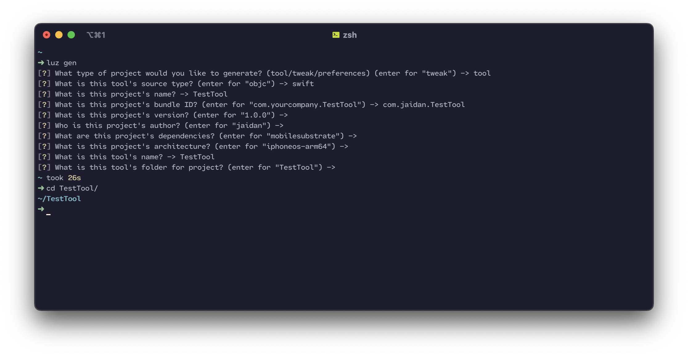

Generation
---------------------

Luz comes with a built-in project generator called ``LuzGen``. It can be used to create a new project with the following command:

.. code:: bash

    $ luz gen

This command will walk you through the steps to create a new project. First, it will ask you what kind of project you want to generate. Then, you can choose from different languages, such as Objective-C, Swift or Assembly. Finally, you enter project metadata, such as the name, author, version, etc. Below, you can find an example of how to use ``LuzGen``.

