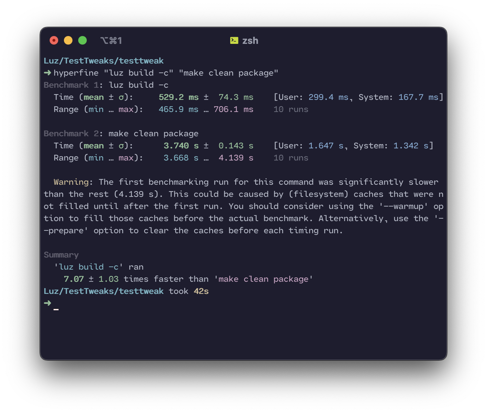

.. Luz documentation master file, created by
   sphinx-quickstart on Wed Feb 15 23:05:07 2023.
   You can adapt this file completely to your liking, but it should at least
   contain the root `toctree` directive.

Luz
===============================

Luz is a build system for Apple Darwin-based systems. It's name is derived from the Spanish word for "light." It's meant to be a lightweight, drop in replacement for other build systems such as Dragon and Theos.

Benifits over "theos" and "dragon"
----------------------------------

Note: Luz is a work-in-progress project. Features will change, and bugs will be fixed. If you find a bug, please report it on the GitHub repository.

Speed
*****************************

Luz is written in pure Python, and only uses libraries that I've created myself. This means that it's very fast, and can be used on any system that has Python 3.7 or higher installed. Luz especially shines when building projects with submodules, as it can build all of the submodules in parallel. This means that building a project only takes as long as the longest build time of any of the submodules.

Below you can find a benchmark of Luz vs. Theos, using the time comparison tool `hyperfine`. The same tweak was built (clean) with both build systems.

.. note::

   This benchmark was ran on a 2020 MacBook Pro with an M1 processor, 8 GB of RAM, and a 256 GB SSD.

As you can see, Luz is much faster than Theos, and is able to build the same project in less than half the time.

Source Code Structure
*****************************
Each of Luz's modules have a different source file, which are all subclassed from a main class called `Module`. This allows for easy extensibility, and allows for the creation of new modules without having to modify the core of the build system.

.. toctree::
   :maxdepth: 2
   :caption: Contents:

   setup
   commands
   generation
   format